# Handwritten-to-Data — Rukopys Ukrainian Document AI


> **Competition:** Ukrainian Catholic University / Rukopys  
> **Task:** Detect, classify, and transcribe content regions in Ukrainian document images  
> **Dataset:** `UkrainianCatholicUniversity/rukopys`  
> **Metric:** Combined layout quality and transcription accuracy  
> **Output:** Kaggle-compatible `submission.csv`

---

## Table of Contents

- [Project Purpose](#project-purpose)
- [Problem Definition](#problem-definition)
- [What Is a Region?](#what-is-a-region)
- [Dataset Source and Rules](#dataset-source-and-rules)
- [Final Output Format](#final-output-format)
- [System Architecture](#system-architecture)
- [Repository Structure](#repository-structure)
- [Data Pipeline](#data-pipeline)
- [Model Architecture](#model-architecture)
- [Implementation Stages](#implementation-stages)
- [Installation](#installation)
- [Execution Order](#execution-order)
- [Dataset Inspection](#dataset-inspection)
- [Recognition Crop Preparation](#recognition-crop-preparation)
- [YOLO Dataset Preparation](#yolo-dataset-preparation)
- [Evaluation Metric](#evaluation-metric)
- [Text Normalization](#text-normalization)
- [Experiment Tracking](#experiment-tracking)
- [Training Readiness Gates](#training-readiness-gates)
- [Local Laptop Notes](#local-laptop-notes)
- [Kaggle and Colab Training Notes](#kaggle-and-colab-training-notes)
- [Final Inference Constraint](#final-inference-constraint)
- [Key Files Reference](#key-files-reference)
- [Risks and Mitigations](#risks-and-mitigations)
- [Validation Checklist](#validation-checklist)
- [References](#references)

---

## Project Purpose

This project builds a full AI pipeline for the **Rukopys Ukrainian handwritten document challenge**.

The system receives a scanned Ukrainian document page and produces structured predictions for all important document regions. It must detect each region, classify its type, transcribe readable Ukrainian text, normalize the output, sort regions in reading order, and generate a valid Kaggle submission file.

The project is designed in two layers:

1. **Foundation layer** — dataset loading, validation, visualization, preprocessing, splitting, crop generation, YOLO conversion, metric utilities, and submission validation.
2. **Training layer** — detector training, recognizer fine-tuning, model evaluation, ensembling, post-processing, and final inference.

The foundation should pass all quality gates before heavy ML training begins.

---

## Problem Definition

Given a Ukrainian document image, the system must:

1. Detect every meaningful content region.
2. Predict each region bounding box.
3. Classify the region type.
4. Transcribe readable text regions.
5. Leave non-text visual regions empty.
6. Sort detected regions in natural reading order.
7. Build a valid JSON prediction per page.
8. Generate a Kaggle-compatible `submission.csv`.

---

## What Is a Region?

A region is an important rectangular area on a document page.

| Type | Meaning | Has Text? | Detector Class ID |
|---|---|---:|---:|
| `handwritten` | Handwritten Ukrainian text | Yes | `0` |
| `printed` | Printed or typed text | Yes | `1` |
| `formula` | Mathematical expression or formula | Yes | `2` |
| `table` | Structured table area | Yes | `3` |
| `annotation` | Margin note, stamp, or annotation | Yes | `4` |
| `image` | Embedded photo or drawing | No | `5` |
| `graph` | Chart, plot, or diagram | No | `6` |

Text recognizers should only run on readable text-like regions. `image` and `graph` regions should still be detected, but their `text` value should normally be an empty string.

---

## Dataset Source and Rules

**Hugging Face Dataset:** `UkrainianCatholicUniversity/rukopys`

| Split | Content | Use |
|---|---|---|
| `train` | Human-verified annotations | Train and validate |
| `silver` | Auto-generated annotations | Later self-training only |
| `test` | Images only, no ground truth | Final inference only |
| `sample_submission.csv` | Format guide | Submission validation only |

Important rules:

- Do not train on `test`.
- Do not train on `sample_submission.csv`.
- Use `train` for baseline training and local validation.
- Use `silver` only after the baseline is stable.
- Filter noisy silver annotations before using them for self-training.
- Keep a strict validation split to avoid leaderboard-only guessing.

---

## Final Output Format

Each document page should produce a JSON list like this:

```json
[
  {
    "bbox": [50, 100, 850, 130],
    "type": "handwritten",
    "text": "Доброго ранку"
  },
  {
    "bbox": [50, 150, 600, 300],
    "type": "table",
    "text": "..."
  },
  {
    "bbox": [20, 80, 400, 120],
    "type": "image",
    "text": ""
  }
]
```

The final submission file should contain one prediction per test image, serialized in the format expected by the competition.

---

## System Architecture

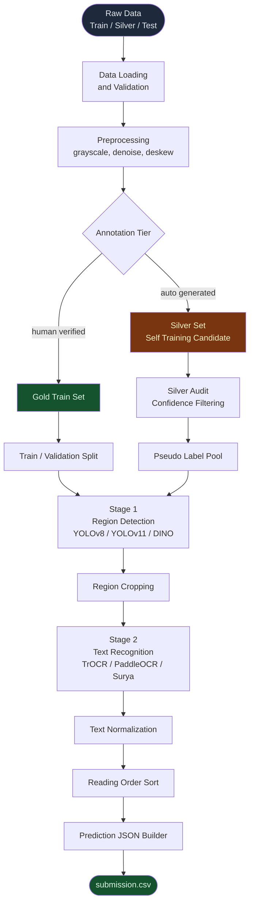

---

## End-to-End Pipeline

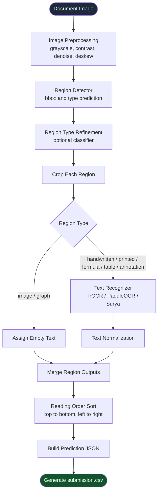

---

## Repository Structure

```text
handwritten-data/
├── README.md
├── requirements.txt
├── requirements-training.txt
├── .gitignore
│
├── configs/
│   ├── data.yaml
│   ├── detector.yaml
│   └── recognizer.yaml
│
├── data/
│   ├── raw/
│   │   ├── train/images/
│   │   ├── silver/images/
│   │   ├── test/images/
│   │   └── sample_submission.csv
│   ├── processed/
│   │   ├── train_raw.jsonl
│   │   ├── test_raw.jsonl
│   │   ├── train_split.jsonl
│   │   ├── val_split.jsonl
│   │   └── dataset_stats.json
│   ├── crops/
│   │   ├── train/images/
│   │   ├── train/labels.csv
│   │   ├── val/images/
│   │   └── val/labels.csv
│   ├── yolo/
│   │   ├── images/train/
│   │   ├── images/val/
│   │   ├── labels/train/
│   │   ├── labels/val/
│   │   └── data.yaml
│   └── submissions/
│
├── notebooks/
│   ├── 01_explore_dataset.ipynb
│   ├── 02_visualize_annotations.ipynb
│   ├── 03_prepare_crops.ipynb
│   ├── 04_prepare_yolo.ipynb
│   └── 05_local_validation.ipynb
│
├── src/
│   ├── data/
│   │   ├── inspect_dataset.py
│   │   ├── load_dataset.py
│   │   ├── dataset_stats.py
│   │   ├── make_splits.py
│   │   ├── bbox_validation.py
│   │   └── foundation_readiness.py
│   │
│   ├── visualization/
│   │   ├── draw_bboxes.py
│   │   ├── draw_yolo_labels.py
│   │   └── crop_contact_sheet.py
│   │
│   ├── preprocessing/
│   │   ├── image_cleaning.py
│   │   ├── deskew.py
│   │   └── tiling.py
│   │
│   ├── detection/
│   │   ├── convert_to_yolo.py
│   │   ├── validate_yolo.py
│   │   ├── train_yolo.py
│   │   ├── train_dino.py
│   │   └── nms.py
│   │
│   ├── recognition/
│   │   ├── prepare_crops.py
│   │   ├── validate_crops.py
│   │   ├── train_trocr.py
│   │   ├── train_paddle.py
│   │   └── postprocess.py
│   │
│   ├── evaluation/
│   │   ├── cer.py
│   │   ├── iou.py
│   │   └── local_metric.py
│   │
│   ├── postprocessing/
│   │   ├── normalize_text.py
│   │   ├── reading_order.py
│   │   └── build_regions.py
│   │
│   ├── submission/
│   │   ├── build_empty_submission.py
│   │   ├── build_submission.py
│   │   └── validate_submission.py
│   │
│   ├── utils/
│   │   ├── paths.py
│   │   ├── jsonl.py
│   │   ├── config.py
│   │   └── logging.py
│   │
│   └── pipeline.py
│
├── checkpoints/
│   ├── detector/
│   └── recognizer/
│
└── outputs/
    ├── debug_images/
    ├── reports/
    └── logs/
```

---

## Data Pipeline

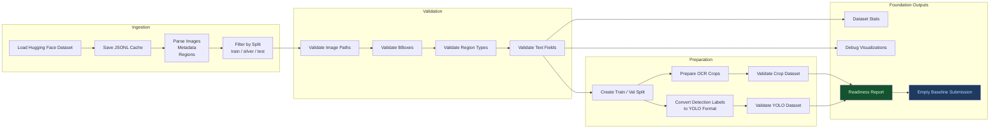

---

## Region Type Distribution

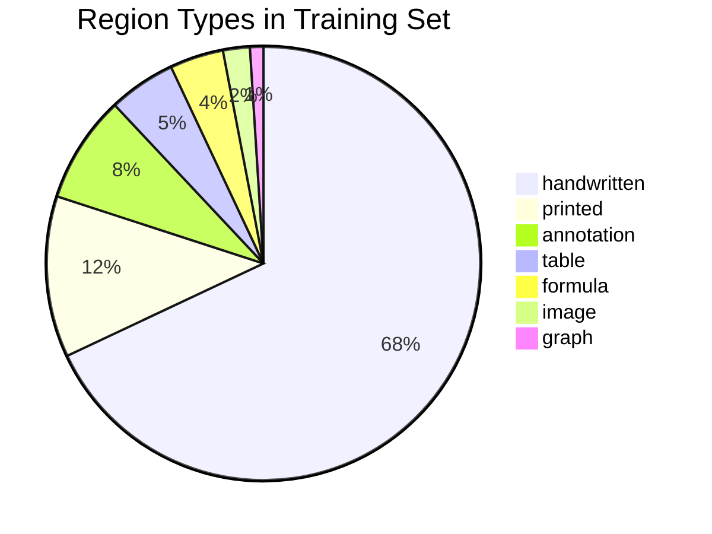

---

## Model Architecture

### Stage 1 — Region Detection

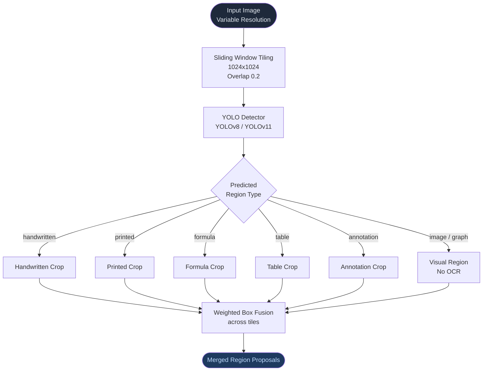

### Stage 2 — Text Recognition

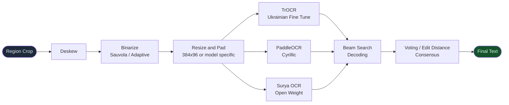

---

## Implementation Stages

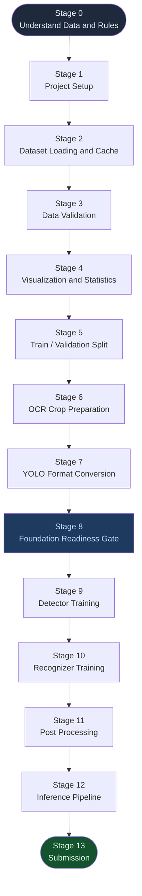

---

## Training Roadmap

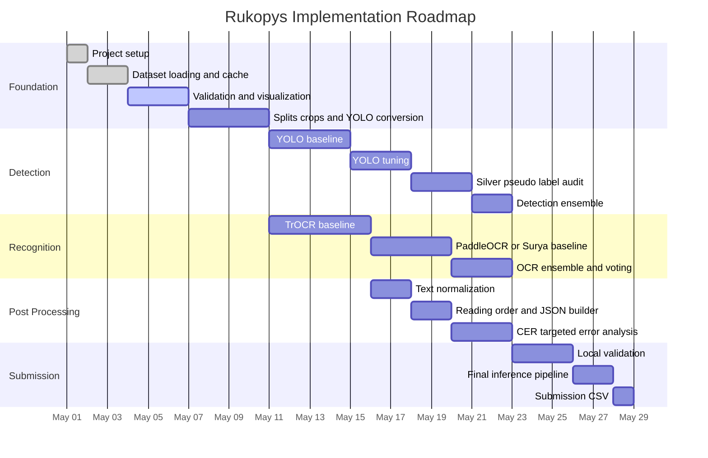

---

## Installation

### Step 1 — Clone the Repository

```bash
git clone https://github.com/your-org/handwritten-data.git
cd handwritten-data
```

### Step 2 — Create a Virtual Environment

```bash
python -m venv venv
```

Windows:

```bash
venv\Scripts\activate
```

Linux / macOS:

```bash
source venv/bin/activate
```

### Step 3 — Install Foundation Packages

```bash
pip install -r requirements.txt
```

Do not install heavy training packages until the foundation readiness gate passes.

```bash
pip install -r requirements-training.txt
```

Use the second command only when the dataset pipeline, validation, crops, YOLO conversion, and baseline submission checks are working.

---

## Execution Order

Run these commands in order from the project root.

```bash
# 1. Inspect expected dataset structure
python -m src.data.inspect_dataset

# 2. Load and cache train/test splits from Hugging Face
python -m src.data.load_dataset --splits train test --save-jsonl

# 3. Draw annotation overlays for visual inspection
python -m src.visualization.draw_bboxes --from-jsonl data/processed/train_raw.jsonl

# 4. Generate dataset statistics
python -m src.data.dataset_stats --from-jsonl data/processed/train_raw.jsonl

# 5. Create train / validation split
python -m src.data.make_splits --from-jsonl data/processed/train_raw.jsonl

# 6. Validate all bounding boxes
python -m src.data.bbox_validation

# 7. Prepare recognition crops
python -m src.recognition.prepare_crops --split train
python -m src.recognition.prepare_crops --split val

# 8. Validate recognition crops
python -m src.recognition.validate_crops --split train
python -m src.recognition.validate_crops --split val

# 9. Convert annotations to YOLO detection format
python -m src.detection.convert_to_yolo

# 10. Validate YOLO dataset
python -m src.detection.validate_yolo

# 11. Build empty baseline submission
python -m src.submission.build_empty_submission

# 12. Validate submission CSV
python -m src.submission.validate_submission --csv data/submissions/empty_*.csv

# 13. Run final foundation readiness gate
python -m src.data.foundation_readiness

# 14. Smoke-test utilities
python -m src.evaluation.cer
python -m src.evaluation.iou
python -m src.postprocessing.reading_order
python -m src.postprocessing.normalize_text
python -m src.preprocessing.image_cleaning <any_image_path>

# 15. Install training dependencies only after all gates pass
pip install -r requirements-training.txt
```

---

## Dataset Inspection

Load a cached split:

```python
from src.data.load_dataset import load_split

ds = load_split("train")
print(ds[0]["file_name"])
print(ds[0]["regions"][:2])
```

Stream a split when RAM is limited:

```python
from src.data.load_dataset import stream_split

for sample in stream_split("train"):
    print(sample["file_name"])
    break
```

---

## Visualization

Draw bounding boxes over document images:

```bash
python -m src.visualization.draw_bboxes --n-samples 15
```

Expected output:

```text
outputs/debug_images/
├── sample_001_bboxes.png
├── sample_002_bboxes.png
└── ...
```

Use these images to confirm:

- Bounding boxes align with document regions.
- Region classes are correct.
- No flipped coordinate system exists.
- Tiny or invalid boxes are caught early.
- Text and non-text regions are both represented.

---

## Dataset Statistics

```bash
python -m src.data.dataset_stats --from-jsonl data/processed/train_raw.jsonl
```

Expected outputs:

```text
data/processed/dataset_stats.json
outputs/reports/dataset_stats_train.md
```

Statistics should include:

- Number of documents.
- Number of regions.
- Region type distribution.
- Average regions per page.
- Bbox width and height distribution.
- Text length distribution.
- Legibility distribution.
- Source distribution.

---

## Train / Validation Split

```bash
python -m src.data.make_splits --from-jsonl data/processed/train_raw.jsonl
```

Recommended split:

| Split | Percentage | Output |
|---|---:|---|
| Train | 85% | `data/processed/train_split.jsonl` |
| Validation | 15% | `data/processed/val_split.jsonl` |

The split should preserve document diversity and avoid leaking regions from the same document across train and validation.

---

## Recognition Crop Preparation

Prepare crops for OCR training:

```bash
python -m src.recognition.prepare_crops --split train
python -m src.recognition.prepare_crops --split val
```

Only keep regions that meet these conditions:

- `language = uk`
- `legibility = legible`
- `type` is not `image`
- `type` is not `graph`
- `text` is not empty
- `bbox` is valid
- crop dimensions are usable

Expected outputs:

```text
data/crops/train/images/
data/crops/train/labels.csv
data/crops/val/images/
data/crops/val/labels.csv
```

---

## YOLO Dataset Preparation

Convert annotations into YOLO format:

```bash
python -m src.detection.convert_to_yolo
```

All seven region types should be kept for detection:

```text
handwritten
printed
formula
table
annotation
image
graph
```

Expected outputs:

```text
data/yolo/images/train/
data/yolo/images/val/
data/yolo/labels/train/
data/yolo/labels/val/
data/yolo/data.yaml
```

Validate the generated YOLO dataset:

```bash
python -m src.detection.validate_yolo
```

---

## Empty Baseline Submission

Build an empty baseline:

```bash
python -m src.submission.build_empty_submission
```

This creates a valid submission with empty prediction lists:

```json
[]
```

It will score poorly, but it proves the submission loop works end-to-end.

Validate it:

```bash
python -m src.submission.validate_submission --csv data/submissions/empty_*.csv
```

---

## Evaluation Metric

The score combines layout quality and transcription quality.

```text
Score = alpha * mean_IoU + (1 - alpha) * (1 - mean_CER)
```

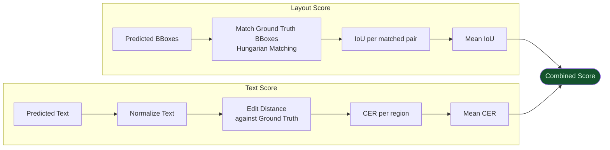

---

## Text Normalization

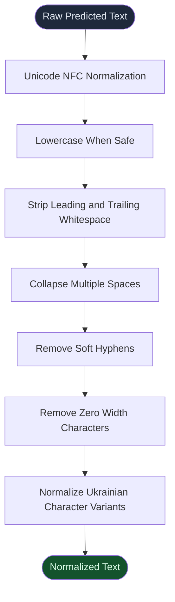

Recommended rules:

- Normalize Unicode with NFC.
- Collapse repeated spaces into one.
- Strip leading and trailing whitespace.
- Remove soft hyphens.
- Remove zero-width characters.
- Preserve meaningful Ukrainian characters.
- Avoid aggressive correction that changes valid words.
- Keep empty text for non-readable regions.

---

## Reading Order

Detected regions should be sorted in natural reading order:

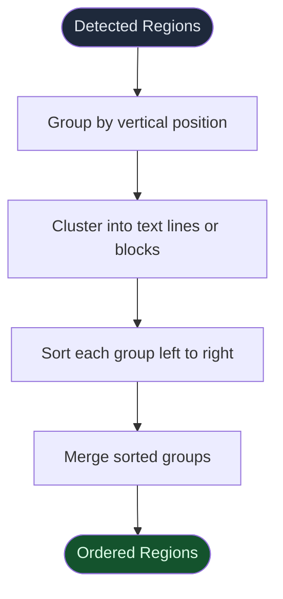

Default reading order:

1. Top to bottom.
2. Left to right within the same visual row.
3. Preserve tables as one region unless table cell extraction is explicitly implemented.
4. Keep visual regions in their page order even when their text is empty.

---

## Experiment Tracking

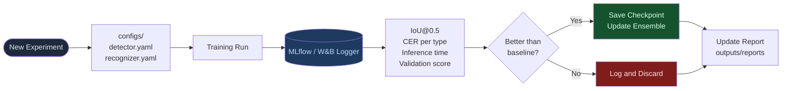

Track every experiment with:

| Item | Example |
|---|---|
| Experiment ID | `det_yolo_v1_001` |
| Dataset version | `train_split_v1` |
| Model | `yolov8m.pt` |
| Image size | `1024` |
| Augmentations | rotation, contrast, perspective |
| Validation IoU | `0.72` |
| CER | `0.18` |
| Inference time | `x ms / image` |
| Notes | failure modes, next action |

---

## Training Readiness Gates

### Detector Gate

Detector training can begin only when:

- [ ] `data/processed/train_split.jsonl` exists.
- [ ] `data/processed/val_split.jsonl` exists.
- [ ] Bounding box validation passes with zero critical errors.
- [ ] `data/yolo/images/train/` contains images.
- [ ] `data/yolo/images/val/` contains images.
- [ ] `data/yolo/labels/train/` contains `.txt` label files.
- [ ] `data/yolo/labels/val/` contains `.txt` label files.
- [ ] `data/yolo/data.yaml` exists.
- [ ] YOLO validation report is generated.
- [ ] Annotation debug images are visually inspected.
- [ ] YOLO debug images are visually inspected.

### Recognizer Gate

Recognizer training can begin only when:

- [ ] `data/processed/train_split.jsonl` exists.
- [ ] `data/processed/val_split.jsonl` exists.
- [ ] `data/crops/train/images/` contains crops.
- [ ] `data/crops/val/images/` contains crops.
- [ ] `data/crops/train/labels.csv` is non-empty.
- [ ] `data/crops/val/labels.csv` is non-empty.
- [ ] Crop validation passes with zero critical errors.
- [ ] Random crop contact sheet is visually inspected.
- [ ] CER utility exists and is tested.
- [ ] Recognizer readiness report is generated.

### Submission Gate

Submission generation can begin only when:

- [ ] Test image list loads correctly.
- [ ] `sample_submission.csv` is parsed only as a format guide.
- [ ] Prediction JSON is valid.
- [ ] Required fields exist: `bbox`, `type`, `text`.
- [ ] Bbox values are numeric.
- [ ] Region types are valid.
- [ ] Empty predictions are accepted.
- [ ] Final CSV validates locally.

---

## Local Laptop Notes

The foundation layer can run on:

| Hardware | Status |
|---|---|
| 8 GB RAM | Suitable for foundation work |
| Core i5 CPU | Suitable for data prep and validation |
| No GPU | Fine for foundation, not ideal for training |

Tips:

- Use streaming when RAM is limited.
- Avoid loading the full dataset into memory unnecessarily.
- Generate crops in batches.
- Save visualizations to disk instead of displaying them live.
- Start with a small subset before processing everything.
- Train serious models on Kaggle, Colab, or a GPU machine.

---

## Kaggle and Colab Training Notes

Upload this repository as a Kaggle dataset or mount it in Colab.

Kaggle path example:

```python
import sys
sys.path.insert(0, "/kaggle/input/handwritten-data")
```

Recommended cache settings:

```bash
export TRANSFORMERS_CACHE=/kaggle/working/
export HF_HOME=/kaggle/working/
```

YOLO training example:

```bash
yolo detect train data=data/yolo/data.yaml model=yolov8m.pt imgsz=1024 epochs=50 batch=8
```

TrOCR fine-tuning should follow:

```text
configs/recognizer.yaml
```

---

## Final Inference Constraint

The final submission pipeline must use open-weight models only.

Do not use:

- OpenAI API
- Anthropic API
- Google Gemini API
- Closed proprietary OCR APIs

Allowed options:

- YOLOv8 / YOLOv11 for detection.
- DINO-based detector if implemented locally.
- TrOCR for recognition.
- PaddleOCR for recognition.
- Surya OCR for recognition.
- Open-weight Hugging Face models.

The final inference pipeline should be designed to fit on a single **NVIDIA H100 80 GB** GPU.

---

## Inference and Submission

Run full inference on test images:

```bash
python src.pipeline \
    --images data/raw/test/images/ \
    --metadata data/processed/test_raw.jsonl \
    --det-weights checkpoints/detector/yolo_best.pt \
    --ocr-weights checkpoints/recognizer/trocr_best/ \
    --output data/submissions/submission.csv
```

Validate the final submission:

```bash
python -m src.submission.validate_submission --csv data/submissions/submission.csv
```

Expected output:

```text
data/submissions/submission.csv
```

---

## Key Files Reference

| File | Purpose |
|---|---|
| `configs/data.yaml` | Paths, class map, dataset settings |
| `configs/detector.yaml` | Detector training configuration |
| `configs/recognizer.yaml` | OCR recognizer training configuration |
| `src/utils/paths.py` | Central path resolver |
| `src/utils/jsonl.py` | JSONL reading and writing helpers |
| `src/data/load_dataset.py` | Hugging Face dataset loading and streaming |
| `src/data/bbox_validation.py` | Bounding-box quality gate |
| `src/data/foundation_readiness.py` | Final foundation readiness checker |
| `src/visualization/draw_bboxes.py` | Draw annotation overlays |
| `src/recognition/prepare_crops.py` | Extract OCR crop images and labels |
| `src/recognition/validate_crops.py` | Validate OCR crop dataset |
| `src/detection/convert_to_yolo.py` | Convert annotations to YOLO format |
| `src/detection/validate_yolo.py` | Validate YOLO dataset |
| `src/evaluation/cer.py` | Character Error Rate metric |
| `src/evaluation/iou.py` | Intersection over Union metric |
| `src/postprocessing/normalize_text.py` | Text cleanup and normalization |
| `src/postprocessing/reading_order.py` | Sort regions for final prediction |
| `src/submission/build_empty_submission.py` | Empty baseline submission builder |
| `src/submission/build_submission.py` | Final submission builder |
| `src/submission/validate_submission.py` | Pre-upload CSV validator |
| `src/pipeline.py` | End-to-end inference pipeline |

---

## Risks and Mitigations

| Risk | Likelihood | Impact | Mitigation |
|---|---|---:|---|
| Silver annotations are noisy | Medium | High | Use only after baseline and filter by confidence |
| OCR struggles with messy handwriting | High | High | Fine-tune TrOCR and use OCR ensembling |
| Tiling creates duplicate boxes | Medium | Medium | Use overlap plus WBF or NMS |
| Small regions are missed | Medium | High | Use high-resolution training and careful augmentation |
| Tables are hard to transcribe | Medium | Medium | Detect as regions first, improve table handling later |
| Ukrainian Cyrillic errors increase CER | High | High | Use Ukrainian-aware normalization and tokenizer tuning |
| Validation split is not representative | Medium | High | Stratify by source and document characteristics |
| Submission JSON breaks CSV format | Medium | High | Always run local submission validator |

---

## Validation Checklist

Before training:

- [ ] Dataset loads from Hugging Face or local cache.
- [ ] Raw train and test JSONL files are created.
- [ ] Region types match the allowed class map.
- [ ] Bounding boxes are valid.
- [ ] Debug images show correct annotation alignment.
- [ ] Dataset statistics report is generated.
- [ ] Train and validation splits exist.
- [ ] Recognition crops are generated.
- [ ] YOLO labels are generated.
- [ ] Empty baseline submission validates.

Before submission:

- [ ] Detector checkpoint exists.
- [ ] Recognizer checkpoint exists.
- [ ] Inference pipeline runs on a small test subset.
- [ ] Prediction JSON contains `bbox`, `type`, and `text`.
- [ ] Non-text regions have empty text.
- [ ] Text normalization is applied.
- [ ] Reading order sorting is applied.
- [ ] Submission CSV validates locally.
- [ ] Final run uses open-weight models only.

---

## References

- [Rukopys Dataset — Hugging Face](https://huggingface.co/datasets/UkrainianCatholicUniversity/rukopys)
- [Ultralytics YOLO](https://github.com/ultralytics/ultralytics)
- [TrOCR Paper](https://arxiv.org/abs/2109.10282)
- [PaddleOCR](https://github.com/PaddlePaddle/PaddleOCR)
- [Weighted Boxes Fusion](https://arxiv.org/abs/1910.13302)

---

## Project Status

This README defines the full project foundation and implementation flow.

Current priority:

```text
Foundation first.
Training second.
Submission last.
```

The project should not move into serious training until the data pipeline, validation scripts, crop preparation, YOLO conversion, metric utilities, and submission validation are all working correctly.
